ITDB - IT Items Database - Free IT Asset Management Software  function printmail(host,username) { document.write('&lt;a class=tl href="mailto:'+ username+'@'+host+'"&gt;'+username+'@'+host+'&lt;/a&gt;'); } 

ITDB \- IT ITems DataBase _The free asset inventory_

[Back to software list](/software.php)

About
=====

Description
-----------

ITDB is a web based asset inventory management tool used to store information about assets found in office environments, with a focus -but not lmited to- IT assets. It is not or targets for ITIL/CMDB compliance (yet), but it has served me for years and hopefully it will do the same for you :-)  
ITDB comes with sources and is distributed under the GNU Public license.  

[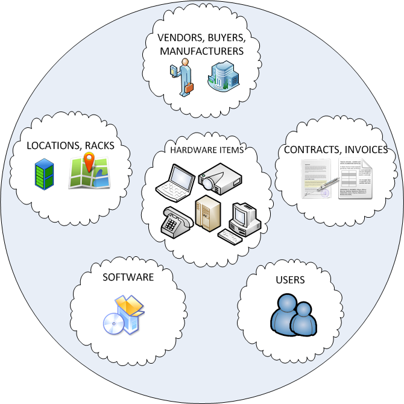](itdb-overview.png)

Security
--------

Please do **NOT** expose ITDB to the public internet. It is not secure, it is aimed for intranets. If you need to do so, please at least use https and configure an HTTP auth password on your web server so it will be hidden behind a password.

TODO
----

Not really planned any more.

* Purchase Order management
* Basic Ticketing support
* Configuration/Knowledge/FAQ entries per item/software. (Something easier than attaching files)
* RRD support for historical graph trends
* Item positioning in floor plan, with drag & drop (WIP)
* Better (analytical) licensing models, SLA events, recurring events, descriptions
* Automatic host and software discovery - db auditing
* ISO20000-like features

Features
--------

* **Items**: specs, warranties, s/n, IP info, what other H/W relates/connects to this H/W, item status, event log, assignees
* **Software**: specs, license info, ...
* **Relations**: where each software is installed, license QTY, component relations, contract relations to software/hardware/invoices
* **Invoices**: purchase proofs depicting date, vendor, prices, attached documents
* **Agents**: Vendors, H/W & S/W Manufacturers, Buyers (for different Dpt), Contactors
* **Locations**: location of each asset: building, floor, room, rack, rack row, row depth
* **Contracts**: define custom contract types, like support& maintenance, SLA, etc. Track contract events.
* **Tags**: multiple tags for items and software. You may use tags for grouping according to usage, budget, owner, importance, etc.
* **Files**: attach documents to every main object entity (Items, Software, Invoices, Contracts
* **Users**: who has what or who is responsible for what
* **Racks**: display rack layout with items assigned to each rack row. (supports multiple items/rackrow).
* **Print labels:** print label stickers for tag all your assets, with or without barcode, from phones and laptops to cooling units and ups. Easily define new label paper layouts through the GUI.
* **One click backup**: get a full backup of the ITDB installation and data in a .tar.gz from the main menu. To restore, just extract the backup file on the web server!
* **All pages are printable**: all screen pages/lists/reports print-out nicely, without menus, scrollbars and other clutter.
* **Interface Translations**: translation file support. You may create your own translations (v1.3)
* **Rudimentary LDAP support**: pull userlist for item assignment from an LDAP URL.(Not tested with active directory, and not used for auth.

DOWNLOAD
--------

Current release:  
6/Mar/2016 version 1.23: [itdb-1.23.zip](https://github.com/sivann/itdb/archive/1.23.zip)  
4/Jul/2015 version 1.22: [itdb-1.22.zip](https://github.com/sivann/itdb/archive/1.22.zip)  
2/Jul/2015 version 1.21: [itdb-1.21.zip](https://github.com/sivann/itdb/archive/1.21.zip)  
25/Oct/2014 version 1.14: [itdb-1.14.zip](https://github.com/sivann/itdb/archive/1.14.zip)  
~20/Oct/2014 version 1.13: This version had some unreleased code by mistake.  
~23/Dec/2013 version 1.12: [itdb-1.12.tar.gz](itdb-1.12.tar.gz)  
24/Oct/2013 version 1.11: [itdb-1.11.tar.gz](itdb-1.11.tar.gz)  
~22/Oct/2013 version 1.10: (wrong db version bundled)  
~28/Sep/2013 version 1.9: [itdb-1.9.tar.gz](itdb-1.9.tar.gz)  
  
You can download the current development version on [GitHub](https://github.com/sivann/itdb)  
  
Previous releases are [here](releases_old/?C=M;O=D).  

DEMO
----

The [DEMO](demo/itdb-1.23/) is **read-only** with limited functionality. The demo may be a bit slow, this is due to my provider, not due to itdb.

LICENCE
-------

The software is distributed under GPL. I would be very happy to receive an email describing how you use it!  

Links
-----

* [GitHub](https://github.com/sivann/itdb)
* [Freshmeat/Freecode](http://freecode.com/projects/itdb)
* [ohloh](https://www.ohloh.net/p/itdb)

SCREENSHOTS
-----------

Some screenshots are from previous versions.  
Some screenshots have been edited to wipe-out private info.  

[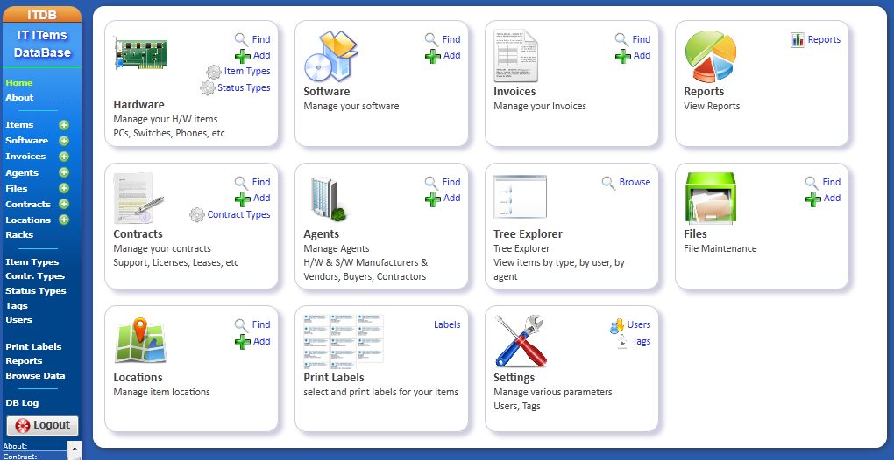   Home](images/itdb-home.png)

[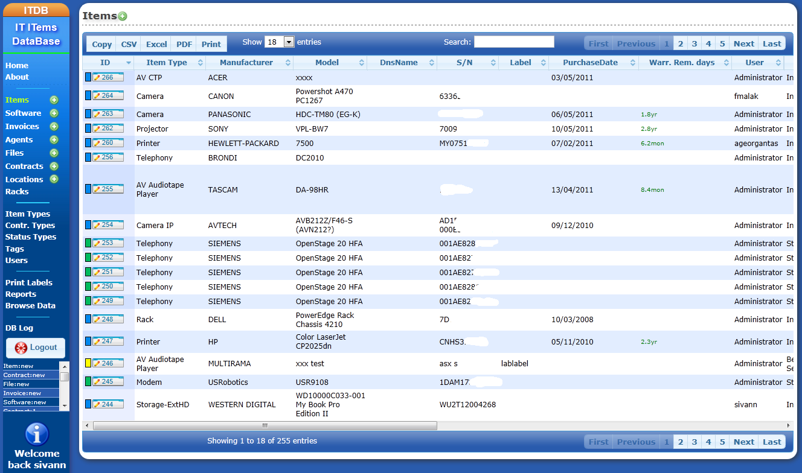   Items Search](images/itdb-listitems.png)

[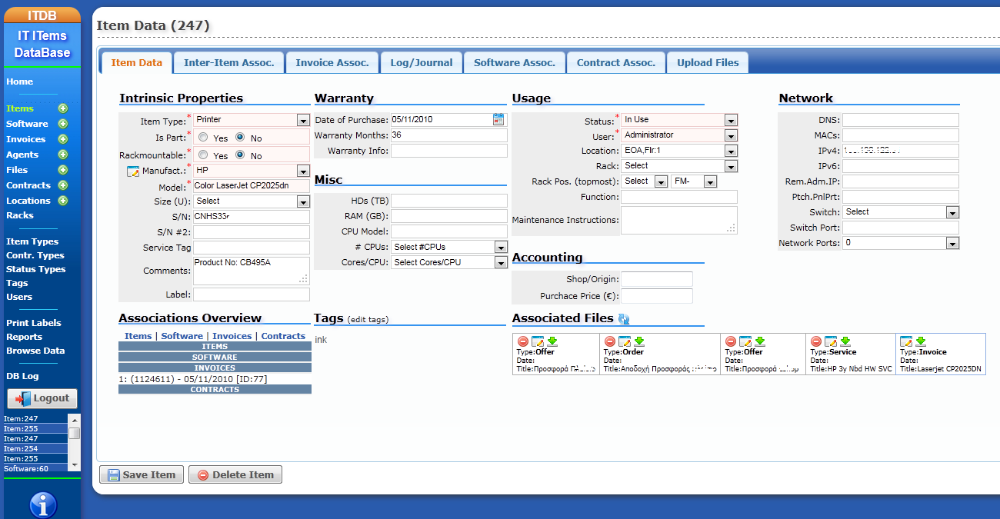   Item Edit](images/itdb-items-edit.png)

[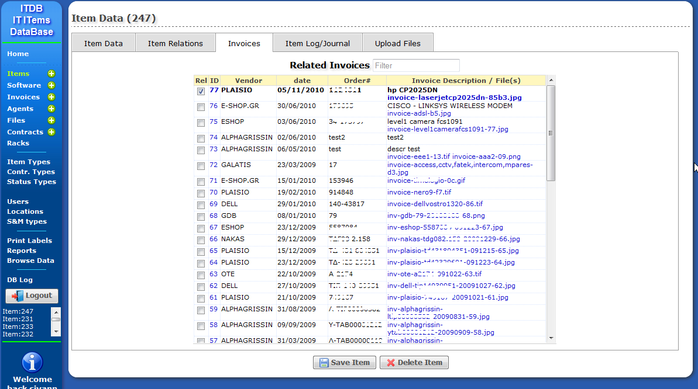   Related Item Invoices](images/itdb-item-invoices.png)

[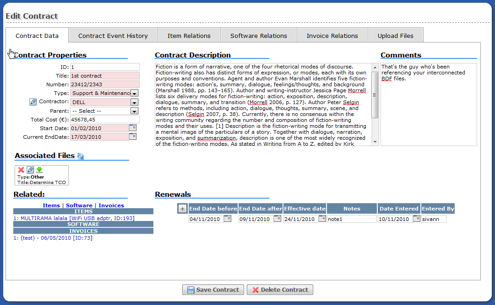   Edit Contract](images/itdb-editcontract.png)

[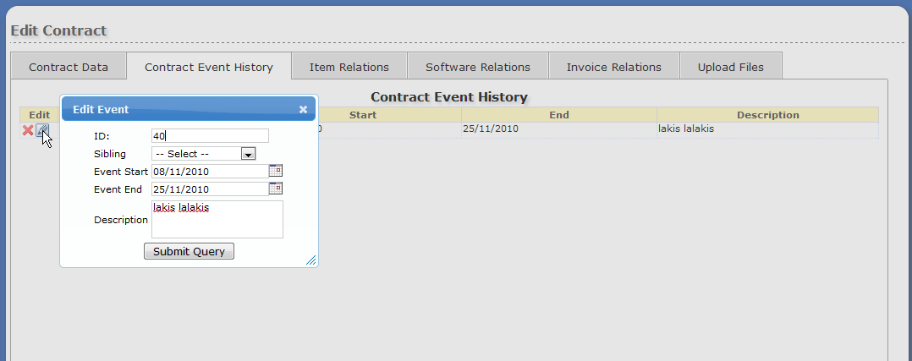   Contract Events](images/itdb-contractevents.png)

[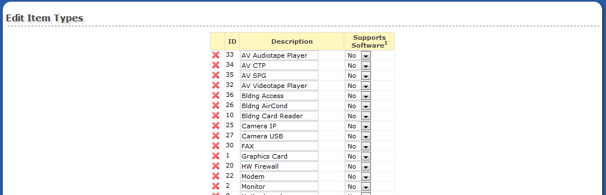   Item Types](images/itdb-itemtypes.png)

[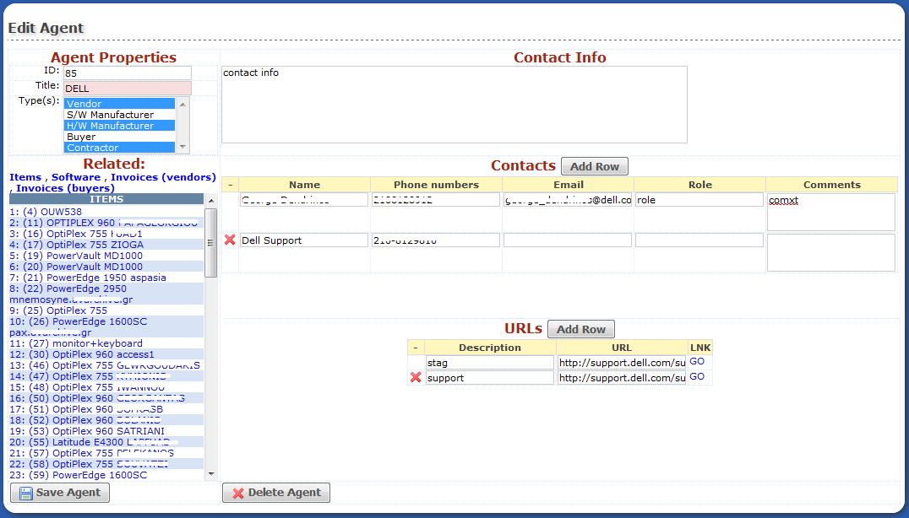   Edit Agent](images/itdb-editagent.png)

[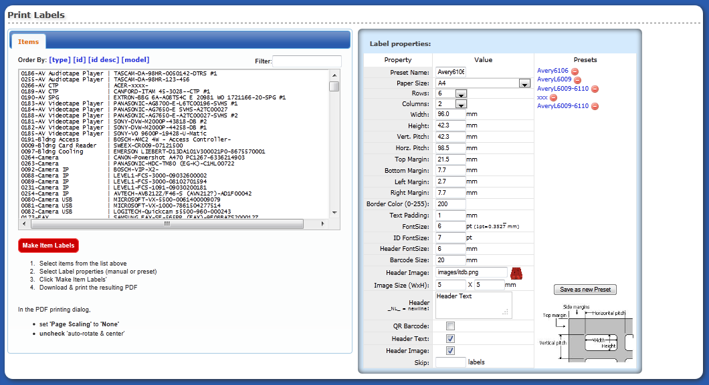   Label Printing](images/itdb-labelprint.png)

[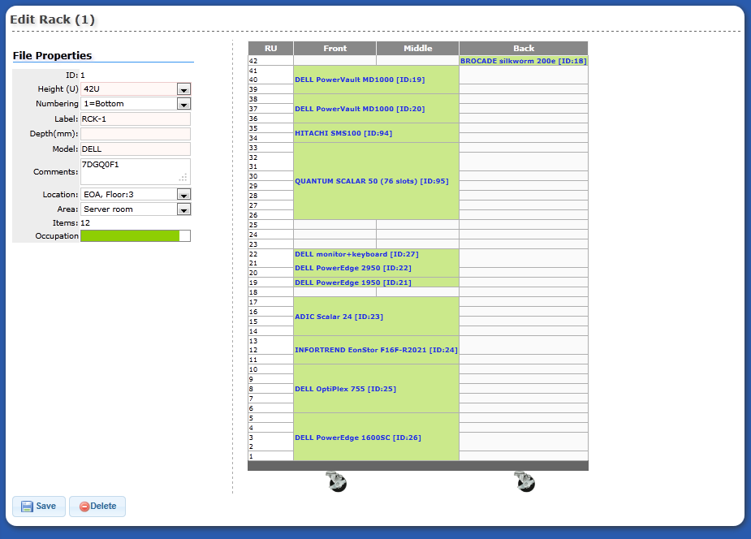   Rack Edit & Side View](images/itdb-editrack.png)

[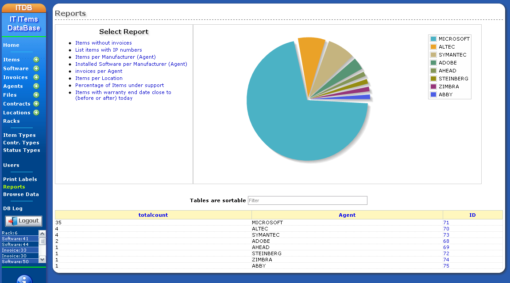   Reports](images/itdb-reportspie.png)

[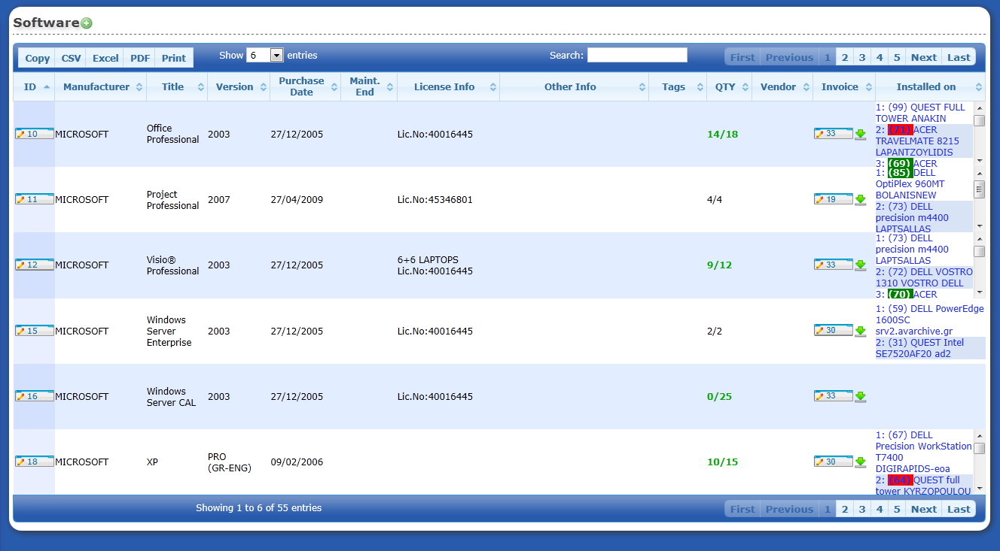   Software List](images/itdb-software-list.png)

[   Software Edit](images/itdb-software-edit.png)

[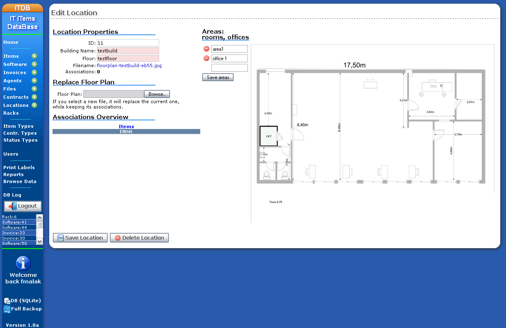   Edit Location](images/itdb-editlocation.png)

[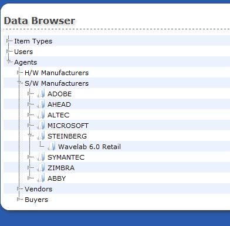   Tree Browser](images/itdb-browse.png "Browse")

[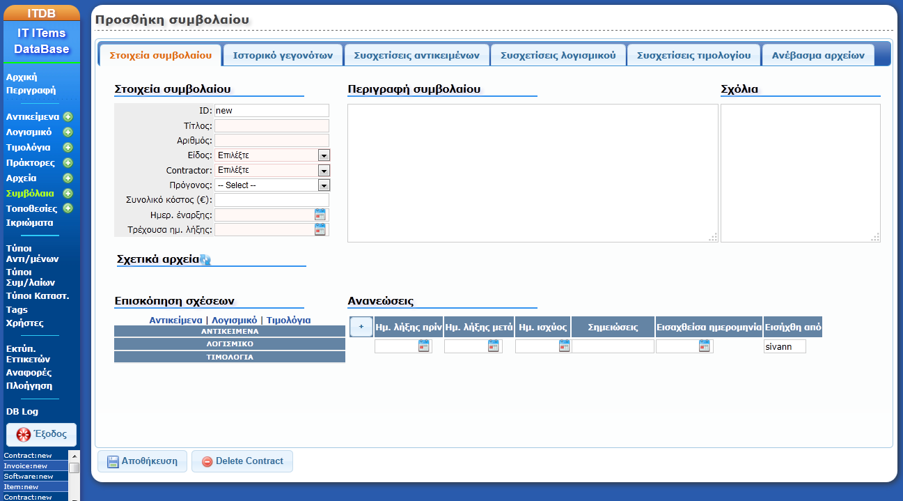   Translation sample](images/itdb-addcontract-trans.png "Greek Translation")

INSTALLATION
============

System Requirements
-------------------

* A recent version of Firefox, Chrome, Opera, etc or IE≥9
* Apache 2.2 on a posix system (linux, solaris, etc) (apache 2.0 may also work)
* PHP > 5.2.x
* PHP SQlite PDO, SQlite >3.6.14.1
* depending on your distribution, you may have to also install packages "php-posix", "php-mbstring", "php5-gd", "php5-json" "php5-sqlite" "php-pdo"

It has been reported to me that it also runs under MS-Windows but I cannot test it.

Installation instructions
-------------------------

1.  extract the files in a web-exported directory (under the "DocumentRoot")
2.  rename pure.db to itdb.db (pure.db is a blank database)
3.  make the data/itdb.db file **AND** the data/ directory **AND** the data/files/ directory readable and writeable by the web server
4.  make translations/ directory readable and writeable by the web server
5.  Login with **admin/admin**

If you need to find out which sqlite library is used by your apache/php installation, browse to itdb/phpinfo.php or press the small blue (i) on the bottom left of the itdb menu.

Upgrade
-------

Instructions are inside the 00-UPGRADE.txt file

Release Notes
-------------

older CHANGELOG is [here](https://github.com/sivann/itdb/commits/master)  
For newer releases, you may see the [commit log](https://github.com/sivann/itdb/commits/master)  

Copyright © 2008-2016 Spiros Ioannou - printmail('gmail.com','sivann');
# Homepage 
http://www.sivann.gr/software/itdb/

# Contributing
Please consider that my free time is now extremely limited, and so even valid pull requests may not be addressed for a long time.

# Status
As I no longer have enough time to improve ITDB, I can only provide bug fixes for newer PHP or browser versions. Please do not ask for new features.
 
# Security
Do *NOT* expose ITDB to the public internet. It is not secure, it is aimed for intranets. If you need to do so, please configure an HTTP auth password on your web server so it will be hidden behind a password.
 
## Scope of pull requests
Thank you for your time to consider contributing. Please take into account ITDB is only an inventory software. It may offer some basic reporting by quering 
its own data because it may have access to invoices, users and equipment.
ITDB tries to adhere to the [do one thing](https://en.wikipedia.org/wiki/Unix_philosophy#Do_One_Thing_and_Do_It_Well) philisophy.
ITDB does not and should not aim to provide the functionality of other software e.g. network monitoring tools, finance software or network diagnostics software. 

## Extent of pull request 
Pull requests should fix 1 and only 1 thing. Otherwise it is extremely difficult to test and review.

### Bug fixes
Please take the time to consider the following when submitting a bug:
* how does your fix handle non-us characters? (E.g. Chinese, Greek, etc)
* how does your fix handle non-us locales ? (especially date manipulation fixes)
* does your fix use strtotime ? (don't use it)
* how does your fix handle older SQLite versions? 
* how does your fix handle older/newer PHP versions? 
* how does your fix work with Firefox/Chrome/IE ?
* how does your fix scale with lots of items?

### New UI fields pull requests:
Please take the time to consider the following when submitting a generic pull-request :
* Is your new  field universally useful? Can you think of cases where it doesn't make sense?
* Can your functionality be already addressed by the current fields?
* Does  your field have specific search needs?

if the answer is no to at least one of the above then probably you don't need that field. ITDB has a lot of fields on the "no" category, let's not add any more.

## Welcomed pull requests
Any pull requests fixing the following would be welcome. Please open a discussion before starting to code.

### Major contributions
* rewrite the DB requests using PDO (and prepared statements)
* rewrite the item associations tables using datatables with server-side AJAX
* update datatables to the most recent version
* rewrite the front controller and auth using a framework (e.g. slim)
* very simple ticketing
 
### Minor contributions
#### UI
* item user selection and possibly others: instead of pull-down select, use jqueryui's autocomplete combobox
* inplace edit/add itemtypes, agents, users. Configurable to allow edit/add for specific user and select for others.
* design PC/server layout in Locations. Assign Items to x/y over imagemap
* edit previous/next item functionality. E.g. from an item list of a search result. 
* replace file uploader with a recent one also supporting drag&drop 
* unify tab association code

### Schema
* add history (renewals) & events in software, like in items.
* list of services and relations to items
* virtual/non virtual item (e.g. VM). Parent (physical) item. Virtual may show as tooltip of rack position of parent. Also
* add knowledge area, with connections to items & software (text)
* software classes (types). E.g. O/S
* add a cron notification sample script in contrib/ for contract/warranty expiration
* license models: on inventory data:per installation, OEM and machine licensing. On external data sources: qualified desktop, CPU, user, named user, server, client access license (CAL), site, enterprise and user-defined models. TBD.
* port connectivity management (TBD if needed)
* power cable management (TBD if needed)

Thank you!
